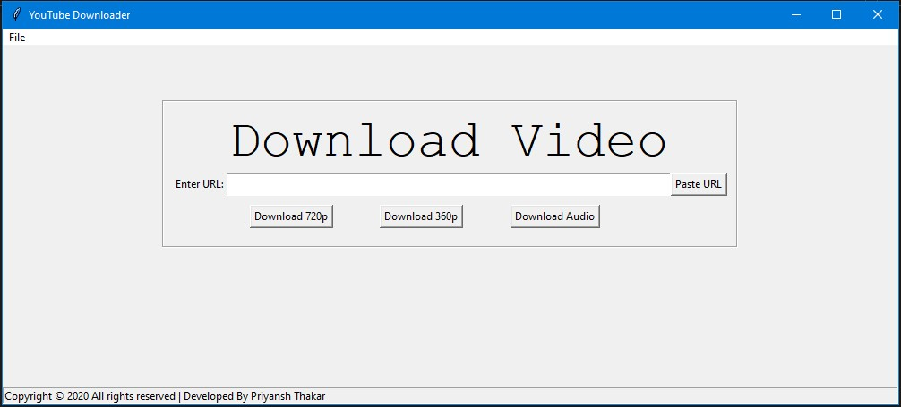
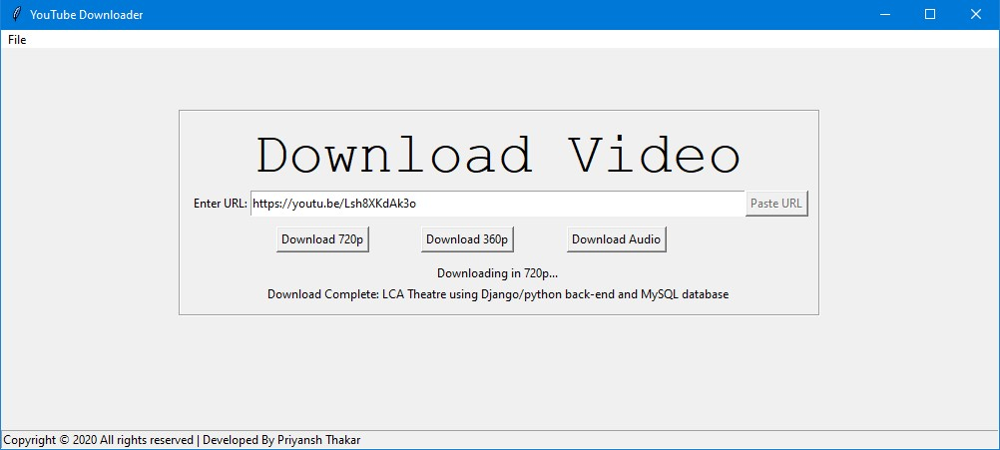

# YouTube Downloader using Python/Tkinter
## A Desktop application to easily download videos from YouTube
This project was completed by me as part of a self-initiated assignment. 

## Problem Statement:
### User Tasks:
<ol>
  <li>Paste URL to start download.</li>
  <li>User can download in 720p, 360p or only audio.</li>
  <li>Video will be downloaded beside the main file.</li>
</ol>

## Technologies used: 
- Python
- Tkinter
- PyTube

## Note:

<b>Direct Download the `Youtube Downloader.exe` file to start using the software instantly.</b>

## Usage:

    pip install pytube
    
    pip install pyinstaller

    pyinstaller.exe --onefile -w --icon=favicon.ico main.py
    
## Screenshots : 

